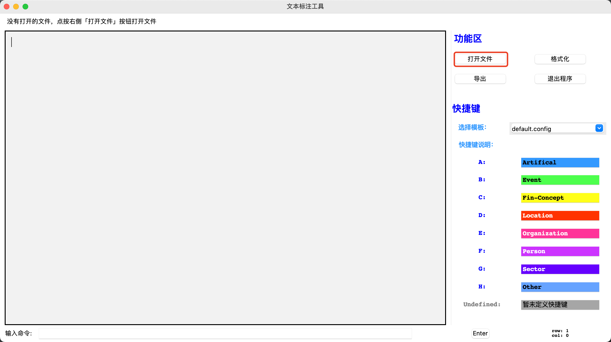

## 中文文本标注工具
得益于开源标注工具[YEDDA](https://github.com/jiesutd/YEDDA) 
，我可以标注自己的文本用于训练。但我发现这个工具是在python2下运行的，因此，我将其移植到了python3下，对UI和部分功能做了一些改变。

## 使用说明
> 最好保证python的版本高于3.7.x，否则可能会出现未知的错误

1. 直接运行`python YEDAA-py3.py`启动程序。
   
2. 点击左侧的「打开文件」，读入一个文档，目前只支持`.txt`格式。

   
3. 支持通过快捷键进行标注，每个快捷键对应的标签在「快捷键说明」区列出；为了美观，目前最多支持设置10个快捷键，且快捷键不区分大小写；在标注的时候确保在输入法在英文模式下。
   
4. 如果要修改快捷键，请参考`./configs/default.config`文件的格式，自定义自己的快捷键映射文件，然后以`.config`为后缀保存至`.
   /configs`文件夹内。重启程序后，就可以在「选择模板」的下拉列表中选择该文件。注意，快捷键请设置为单个字符，否则会报错。
   
5. 标注方法为：按住鼠标左键，选择对应的文本，然后按下对应的快捷键即可。

6. 标注完成后，点击「导出」，即可将标注后的文本导出。

7. 点击「退出程序」，退出本程序。

### 更新信息：

- 2021.5.13：第一次更新完成